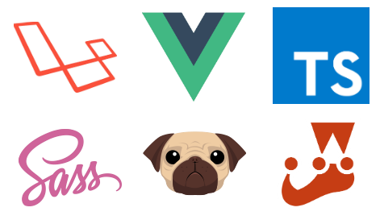

# Laravel Vue User Management

  

A Laravel 5.5 Single Page Application boilerplate using Vue.js 2.5, Bootstrap 4, TypeScript, Sass and Pug with:

* A users CRUD if the current user is an admin.
* i18n for English, Portuguese and Spanish, based on browser language settings.
* Authentication using JWT.
* WebSockets with Laravel Echo and Pusher.
* Vue component tests using Jest and API tests using PHPUnit.
* Already configured to run tests on Docker, GitLab CI ([with continuous deploy](./DEPLOY.md)), Travis CI, CircleCI, AppVeyor and VSTS CI on Windows, Linux and macOS.
* Dockerfile configured with PHP 7, Node.js 8, Yarn and Composer, with MySQL and phpMyAdmin on Docker Compose.

You can check it live [on this website](http://lvb.alefe.io), with the credentials:

Admin user

    E-mail: admin@example.com
    Password: admin

Normal user

    E-mail: normal@example.com
    Password: normal

Notice that all the changed data on that website sample, such as password and CRUD actions, won't be stored.

### With Docker

Run:

    docker-compose up --build

After it starts, just on the first time, run on another terminal:

    docker exec laravel-vue-user bash -c "composer start && yarn start"

The application will be available on http://localhost:8000 and the phpMyAdmin on http://localhost:8081

### Common way

Rename the .env.example file to .env, and fill it with your local info, then:

Install PHP and JavaScript dependencies:

    composer install
    yarn

Generate Laravel keys:

    php artisan key:generate

Generate JWT keys

    php artisan jwt:secret

Generate i18n string for Vue, based on Laravel i18n files:

    php artisan vue-i18n:generate

Migrate and seed the database:

    php artisan migrate --seed

Compile all the front-end stuff:

    yarn prod

Test:

    composer test
    yarn test
